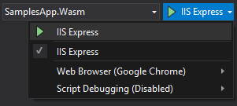
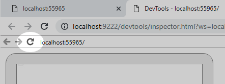

# Getting Started with the Uno Platform

## Prerequisites
* Visual Studio 2017 15.5 or later, with :
	* Xamarin component, with the iOS Remote Simulator installed
	* A working Mac with Visual Studio for Mac, XCode 8.2 or later installed
	* The google Android x86 emulators

## Create an application from the solution template

To easily create an multi-platform application:
* Install the [Uno Solution Template Visual Studio Extension](https://marketplace.visualstudio.com/items?itemName=nventivecorp.uno-platform-addin)
* Create a new C# solution using the **Cross-Platform Library (Uno Platform)** template, from Visual Studio's **Start Page** :

* Update to the latest nuget package named `Uno.UI`, make sure to check the `pre-release` box.
* To debug the iOS head, select the `Debug|iPhoneSimulator` configuration
* To debug the Android head, select the `Debug|AnyCPU` configuration
* To debug the UWP head, select the `Debug|x86` configuration
* To run the WebAssembly (Wasm) head, select **IIS Express** and press **Ctrl+F5**. See below for the debugging instructions.

## Using the WebAssembly C# Debugger
1. Make your project the startup project (right-click **set as startup** in Solution Explorer)
2. In the debugging toolbar:
* Select **IIS Express** as the debugging target
* Select **Chrome** as the Web Browser
* Make sure script debugging is disabled 
  
1. Start the debugging session using `Ctrl+F5` (`F5` will work, but the debugging experience won't be in Visual Studio)
1. Once your application has started, press `Alt+Shift+D` (in Chrome, on your application's tab)
1. A new tab will open with the debugger or instructions to activate it

1. You will now get the Chrome DevTools to open listing all the .NET loaded assemblies on the Sources tab: 

1. You may need to refresh the original tab if you want to debug the entry point (Main) of your application. 

> ### Tips for debugging in Chrome
> * You need to launch a new instance of Chrome with right parameters. If Chrome is your main browser
> and you don't want to restart it, install another version of Chrome (_Chrome Side-by-Side_).
> You may simply install _Chrome Beta_ or _Chrome Canary_ and use them instead.
> * Sometimes, you may have a problem removing a breakpoint from code (it's crashing the debugger).
> You can remove them in the _Breakpoints list_ instead.
> * Once _IIS Express_ is launched, no need to press `Ctrl+F5` again: you simply need to rebuild your
> _Wasm_ head and refresh it in the browser.
> * **To refresh an app**, you should use the debugger tab and press the _refresh button_ in the content.
> * **If you have multiple monitors**, you can detach the _debugger tab_ and put it on another window.
> * For breakpoints to work properly, you should not open the debugger tools (`F12`) in the app's tab.
> * If you are **debugging a library which is publishing SourceLinks**, you must disable it or you'll
> always see the SourceLink code in the debugger. SourceLink should be activated only on Release build.